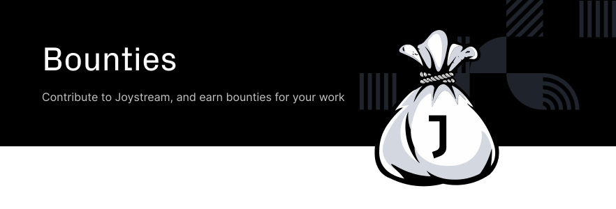

Table of Contents
=================

<!-- TOC START min:1 max:4 link:true asterisk:false update:true -->
- [Overview](#overview)
  - [Summary of Bounties](#summary-of-bounties)
  - [Summary of Testnet Participation Payouts](#summary-of-testnet-participation-payouts)
  - [Total](#total)
    - [Acropolis](#acropolis)
    - [Athens](#athens)
    - [Sparta](#sparta)
- [Contribute](#contribute)
  - [Bounties](#bounties)
    - [Active Bounties](#active-bounties)
    - [Concluded Bounties](#concluded-bounties)
  - [Proposals](#proposals)
    - [Step by Step](#step-by-step)
      - [Title](#title)
- [Announcing Active Bounties](#announcing-active-bounties)
  - [Well Defined Bounties](#well-defined-bounties)
    - [Step by Step](#step-by-step-1)
      - [Title](#title-1)
      - [Body](#body-1)
  - [Less Defined Bounties](#less-defined-bounties)
    - [Step by Step](#step-by-step-2)
      - [Title](#title-2)
      - [Introduction](#introduction)
      - [Further](#further)
<!-- TOC END -->

# Overview
This repo is where we publish, track and document the bounty system for the Joystream platform. Anyone is free to make a [proposal](#proposals) for a bounty, and anyone is free to compete for them.

Currently, all bounties will be made `active`, funded, and will be evaluated by [Jsgenesis](https://blog.joystream.org/jsgenesis/). In the future, our intention is to gradually involve the platform governance system in the decision making.

The payouts will be made in [monero](https://web.getmonero.org/) unless noted otherwise. Our choice of using monero as the method of payment is that it's both a well established and reputable project, and arguably has better privacy features than some of the other options.

Jsgenesis is also making weekly payouts for participation on the [Joystream testnets](https://testnet.joystream.org/). More information about why we're doing this, and how you can participate can be found in our [helpdesk repo](https://github.com/Joystream/helpdesk).

**Keep in mind that our bounty system is a WIP, and it should be expected that changes to the process will be made as the project grows.**

## Summary of Bounties

| Last Updated | Bounties Concluded | Ongoing Bounties | Officially Paid | Old Payouts`*`  |
|:------------:|:------------------:|:----------------:|:---------------:|:---------------:|
| 17.07.19     |        0           |         3        |    **$626**     |     **$214**    |

`*` Denotes bounties paid out before this "official" repo was up. Some of these bounties can be found in other repos, some were simply posted on Telegram.

## Summary of Testnet Participation Payouts

## Total

| Last Updated | Validators | Council Members | Storage Providers| Total           |
|:------------:|:----------:|:---------------:|:----------------:|:---------------:|
| 17.02.20     |   $2057    |      $1747      |     $12580       |   **$16384**    |

### Acropolis

| Last Updated | Validators | Council Members | Storage Providers| Total           |
|:------------:|:----------:|:---------------:|:----------------:|:---------------:|
| 17.02.20     |   $1683    |      $1320      |      $11805      |   **$14808**    |

### Athens

| Last Updated | Validators | Council Members | Storage Providers| Total           |
|:------------:|:----------:|:---------------:|:----------------:|:---------------:|
| 24.06.19     |     $263   |       $272      |      $775        |   **$1310**     |

### Sparta

| Last Updated | Validators | Council Members |     Total       |
|:------------:|:----------:|:---------------:|:---------------:|
| 01.04.19     |     $111   |      $155       |     **$266**    |

# Contribute

Contributors to the Joystream platform shall, if applicable to the scope of work, follow the guidelines outlined [here](https://github.com/Joystream/joystream#contribute) in our [landing repo](https://github.com/Joystream/joystream).

## Bounties

- **Number**
  - When a bounty becomes `active`, it will be assigned a number based on its chronological order.

- **Title**
  - A brief, descriptive title

- **Link**
  - Link to the [issue](https://github.com/Joystream/bounties/issues) with details.

- **Category**
(non-exhaustive)
  - `Bug fix`
  - `Testing`
  - `Documentation`
  - `Improvements`
  - `Marketing`
  - `Governance`
  - `New feature`
  - `Project management`
  - `Help`

- **Start Date**
  - The date the bounty became `active`

- **Assignee(s)**
  - If an applicant has been approved to start work, the person's GitHub `Username` will be listed.
  - In some circumstances, it can be acceptable to just state `Assigned`.

- **Status**
  - [Active Bounties](#active-bounties)
    - `Open`
    - `Assigned`
    - `Under review`
    - `On Hold`
  - [Concluded Bounties](#concluded-bounties)
    - `Completed`
    - `Expired`
    - `Aborted`
  - More details on the status can be found by following the link for the proposal of interest.

- **Paid**
  - The amount paid out thus far.

- **Bounty**
  - [Active Bounties](#active-bounties)
    - The value of the bounty.
  - [Concluded Bounties](#concluded-bounties)
    - The total amount paid out.
  - If the amount is followed by `*`, consult the linked [issue](https://github.com/Joystream/bounties/issues) for more information.

- **End Date**
  - The date the bounty was `concluded`

- **Claimant(s)**
  - If the bounty was successfully claimed, the person's GitHub `Username` will be listed.
  - In some circumstances, it can be acceptable to just state `Claimed`.

### Active Bounties

| Number  |           Title              | Link        | Category         | Start Date  |Assignee(s) | Status     | Paid | Updated | Bounty |
|:-------:|:----------------------------:|:-----------:|:----------------:|:-----------:|:----------:|:----------:|:----:|:-------:|:------:|
| #0      | Fix broken links, formatting, etc in READMEs | [#0](https://github.com/Joystream/bounties/issues/3)| `Documentation`|  27.05.19 | Multiple |    `Open`   | $26 | 17.07.19 |$2`*`  |
| #1      | Improve networking + promotional campaign | [#1](https://github.com/Joystream/bounties/issues/5)| `Marketing`|  27.05.19 |  @mochet     | `Assigned`  |  $550 | 03.07.19 | $N`*`  |
| #2      | Test media formats | [#2](https://github.com/Joystream/bounties/issues/13)| `Testing`|  03.07.19 | @kamalzaman | `On Hold`  |  $50 | 13.07.19 | $50  |
| #3      | Source(s) of content | [#3](https://github.com/Joystream/bounties/issues/20)| `Help`|  18.07.19 | NA | `Under review` |  $0 | NA | $200  |

### Concluded Bounties

| Number  |           Title              | Link                  | Category         | Start Date  | End Date | Status   | Claimant(s)     | Bounty |
|:-------:|:----------------------------:|:---------------------:|:----------------:|:-----------:|:--------:|:--------:|:---------------:|:------:|
| #x      | N/A                          | N/A                   |   N/A            |  dd.mm.yy   | dd.mm.yy |   N/A    |   N/A           |   $N   |

## Proposals

In addition to the Jsgenesis team, community members, new and old, should not be afraid to propose bounties. At some point, we hope to create a system either similar to the [BIP](https://github.com/bitcoin/bips) process for bitcoin and/or to the [FFS](https://forum.getmonero.org/9/work-in-progress) system for monero.

### Step by Step

This section outlines the steps from a proposals is made, to have it become an [Active Bounty](#active-bounties).

1. If you are not familiar with the project and its goals, consider the following sources:
  - The project [manifesto](https://github.com/Joystream/manifesto).
  - The project [whitepaper](https://github.com/Joystream/whitepaper).
  - Our long or short term [OKRs](https://github.com/Joystream/joystream/tree/master/okrs).
Your proposal should preferably be in line with, or at least not orthogonal to these sources. Referring to an issue from one of our other repos can also be a good source.

If you have a proposal that does not really fit under any of the above, feel free to gauge the interest and relevance in a more informal manner, e.g. in one of our communication channels, such as [Telegram](https://t.me/JoyStreamOfficial), or the [forum](https://testnet.joystream.org/#/forum).

2. Make an [issue](https://github.com/Joystream/bounties/issues) in this repo, structured as follows:

#### Title

- **JCP** - **Descriptive Title**

##### Body

- **Problem:**
Provide a description of the problem or improvement you wish to see implemented.
- **Goals:**
A brief description of the goals you hope to achieve, and how it will benefit the Joystream Project.

These are the minimum requirements, but you are encouraged to look at the [bounty structure](#body-1) for anything extra to add.

3. If you wish, announce your proposal in one of our communication channels mentioned above. This will likely generate more feedback.

4. A member of the Jsgenesis team will reply in a timely manner, asking for more information, rejecting or approving your proposal.

5. If it gets approved, Jsgenesis will either write and announce the bounty as described below, or delegate the responsibility.

# Announcing Active Bounties

When a [proposal](#proposals) has been approved, or Jsgenesis have identified something suitable for a bounty, it will be announced as an [issue](https://github.com/Joystream/bounties/issues), and added to the [Active Bounties](#active-bounties) table.

How the process looks from the `Active` stage to `Concluded` will depend on the scope of work, **Category**, payout structure, etc.

## Well Defined Bounties

Most bounties will be fairly contained, well defined and will not require much communication back and forth. These will typically fall under one of the following **Categories**:

- `Bug fix`
- `Testing`
- `Documentation`
- `Improvements`

### Step by Step

1. The [issue](https://github.com/Joystream/bounties/issues) defining the bounty will be opened, and structured as follows:

#### Title

- **Bounty #** - **Descriptive Title** - **$N**

#### Body

- **Problem:**
A description of the problem, and if applicable, a link to the original [proposal](#proposals) and appropriate issue(s) in affected repo(s).
- **Goals:**
A description of what the bounty should achieve.
- **Reward:**
The size and structure of the reward.
- **Scope of Work:**
A well defined scope of work, including any relevant guides and pointers.
- **Deliverables:**
Any requirement regarding format, structure, etc. of the submitted deliverable.
- **Constraints:**
Any constraints that would disqualify or reduce the value of the bounty.
- **Bounty format:**
Whether it's a race, multiple entries can get the reward, etc.
- **Deadline:**
If applicable.

2. Depending on the **Bounty format**, interested parties could or should announce their interest.
    - In some cases, the first `n` will get a deadline to deliver to avoid having multiple parties working unnecessarily on the same problem.

3. Once a party submits their work, a member of Jsgenesis will evaluate the work.

4. If the submitted work qualifies, the payment will be paid and the bounty will be moved from [active](#active-bounties) to [concluded](#concluded-bounties), and the [issue](#https://github.com/Joystream/bounties/issues) will be closed.

## Less Defined Bounties

In some cases, an [Active Bounty](#active-bounties) may not be as well defined and contained. In addition to the "known unknowns" there may be "unknown knowns", and even the dreaded "unknown unknowns".

These kinds of bounties may fall under more than one category, and require several more steps.

### Step by Step

1. The [issue](https://github.com/Joystream/bounties/issues) defining the bounty will be opened, and structured as follows:

#### Title

- **Bounty #** - **Descriptive Title** - **$N** - **Stage**

#### Introduction

- **Problem:**
A description of the problem, and if applicable, a link to the original [proposal](#proposals) and appropriate issue(s) in affected repo(s).
- **Goals:**
A description of what the bounty should achieve.
- **Reward:**
An *estimate* of the size and structure of the reward.
- **Stages:**
An outline of the stages the potential applicants should consider.
- **Application Deadline:**
The deadline for potential applicants to announce their interest, and if applicable, submit the initial **Deliverables**.
- **Bounty format:**
Whether it's a race, multiple entries can get the reward, etc.

#### Further

As outlined earlier, the exact content of this section will vary from time to time. The points below are meant for guidance only.

- **Scope of Work:**
Unlike for the [well defined bounties](#well-defined-bounties), this may be a rough outline, or even just one initial suggestion.
- **Stages:**
An outline of the stages the potential applicants should consider. The stages below are neither fixed, nor exhaustive:
  - *Draft*, denoting feedback, questions and comments are needed.
  - *Initial*, denoting potential applicants can and should produce their initial application.
  - *Tender*, after the *Initial* application has been received, the best contribution will be asked to expand upon their ideas. (Paid stage)
  - *Assigned*, after the *Tenders* have been evaluated, one or more applicants will be assigned the task.
  - *Open for Contribution*, if for some reason the progress is halted, or the assignee(s) needs assistance.
- **Milestones:**
Assuming the **Stages** are sufficiently large and contained/independent, it makes sense to have milestones with partial payouts when one is reached.
  - **Deliverables:**
  For each milestone, there will be a deliverable in one form or another.
- **Constraints:**
Any constraints that the applicants must consider.
  - **Budget:**
  A rough budget, for potential applicants to consider.
  - **Reporting:**
  If and how reporting of progress should be handled.

2. For these kinds of bounties, we expect an iterative process, where community members, the Jsgenesis team, potential applicants and others can ask questions.

3. Once the *Draft* and *Initial* stages have been concluded, Jsgenesis will announce the applicants that will be paid to produce *Tender*, based on input from previous round(s) and Jsgenesis. Note that others can produce a *Tender* as well, but can't expect to be paid for their work.

4. After the *Tenders* are submitted, Jsgenesis will assign the best applicant(s).

5. For each **Milestone** reached, the assignee(s) will receive the agreed part of the payment.

6. Once the final **Milestone** is reached and approved, any outstanding payment will be made, the bounty will be moved from [active](#active-bounties) to [concluded](#concluded-bounties), and the [issue](https://github.com/Joystream/bounties/issues) will be closed.
