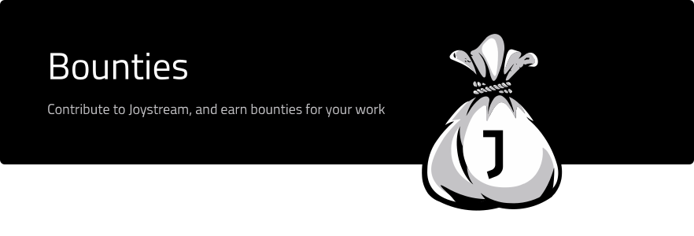

# Table of Contents
<!-- TOC START min:1 max:4 link:true asterisk:false update:true -->
- [Table of Contents](#table-of-contents)
- [Overview](#overview)
- [Contribute](#contribute)
  - [List of Proposals](#list-of-proposals)
    - [Active Proposals](#active-proposals)
    - [Previous Proposals](#previous-proposals)
- [Step by Step Process](#step-by-step-process)
  - [Core Team Proposal](#core-team-proposal)
    - [Smaller Bounties](#smaller-bounties)
      - [Title](#title)
    - [Larger Bounties](#larger-bounties)
      - [Title](#title-1)
  - [Joystream Community Proposal](#joystream-community-proposal)
    - [Structure](#structure)
      - [Title](#title-2)
<!-- TOC END -->

# Overview
This repo is where we publish, track and document the bounty system for the Joystream platform. Anyone is free to propose to propose a bounty, and anyone is free to compete for them.

**Keep in mind this is a WIP, and it should be expected that changes to the process will be made as the project grows.**

# Contribute

Contributors to the Joystream platform shall, if applicable, try to follow the guidelines outlined [here](https://github.com/Joystream/joystream#contribute) in our [landing repo](https://github.com/Joystream/joystream).

## List of Proposals

Below is a list of the active and previous proposals.

Non-exhaustive list of **Categories**
- Marketing
- Governance
- New feature(s)
- Project management
- Improvements
- etc.

### Active Proposals

| Number  |           Title              | Link                  | Category         | Start date  |Assignee (if applicable) | Size of bounty |
|:-------:|:----------------------------:|:---------------------:|:----------------:|:-----------:|:-----------------------:|:--------------:|
| #0      | N/A                          | N/A                   |   N/A            |  yy.mm.dd   |        N/A              |     $N         |

### Previous Proposals

| Number  |           Title              | Link                  | Category         | Start date  | Ended    | Status   | Claimant(s)     | Size of bounty |
|:-------:|:----------------------------:|:---------------------:|:----------------:|:-----------:|:--------:|:--------:|:---------------:|:--------------:|
| #0      | N/A                          | N/A                   |   N/A            |  yy.mm.dd   | yy.mm.dd |   N/A    |   N/A           |     $N         |

# Step by Step Process

This depends on who initiates the bounty. Sometimes, the proposal bounty will be identified and decided by a member of Jsgenesis team. In other cases, it may be community driven.

## Core Team Proposal

A bug, improvement, marketing campaign, etc. is discovered and identified, either internally or someone else. An [issue](issue) will be opened, and structured as follows depending on the magnitude and importance of the bounty.

### Smaller Bounties

If the scope of work around the bounty is fairly well contained and defined, the issue need only contain:

---

#### Title

- **Bounty #** - **Descriptive Title** - **$N**

##### Body

Description of the problem/task and goals.
- If applicable, include link and reference the issue in the repo it was first reported
- Well defined scope of work, including any potential:
  - Deliverable(s)
  - Constraints
  - Deadlines
- Some information on whether it's first come/first served, how many can claim, etc.

### Larger Bounties

If the scope of work is large, complex, and perhaps largely undefined, the structure will be quite different.

---

#### Title

- **Bounty #** - **Descriptive Title** - **$N**

*Note that for Larger Bounties, this will just be a rough estimate*

##### Introduction

High level description of the problem/task and goals.
  - If applicable, include link and reference the issue in the repo it was first reported

##### Executive Summary

A brief summary of the anticipated:
  - Stages
  - Deadline(s)
  - Milestones
  - Deliverables

##### Body

The structure will probably differ quite a lot from time to time, but the body should at contain the following with some level of detail:
  - Stages
  - Deadline(s)
  - Parameters
  - Budget(s)
  - Milestones
  - Deliverables
  - Additional requirements
    - Reporting
    - Documentation
    - Payout structure
  - xyz

## Joystream Community Proposal

Community members, new and old, should not be afraid to propose bounties. At some point, we hope to create a system either similar to the [BIP](https://github.com/bitcoin/bips) process for bitcoin and/or to the [FFS](https://forum.getmonero.org/9/work-in-progress) system for monero.

### Structure

#### Title

- **JIP** - **Descriptive Title**

##### Body

Provide a description of the problem or improvement you wish to see implemented. Ideally, this should not just be random suggestion, but something that is:
- Feasible, both from a technical and economical point of view
- In line with, or at least not orthogonal, to the goals outlined in either:
    1. The project [manifesto](https://github.com/Joystream/manifesto)
    2. The project [whitepaper](https://github.com/Joystream/whitepaper)
    3. Our long or short term [OKRs](https://github.com/Joystream/joystream/tree/master/okrs)
    4. Referring to an issue from one of our other repos

If you have a proposal that this not really fit under any of the above, feel free to gauge the interest and relevance in a more informal manner, eg. in one of our communication channels, such as [rocket.chat](https://chat.joystream.org/home), [telegram](https://t.me/JoyStreamOfficial), or the forum, after it has been introduced in [Acropolis](https://github.com/Joystream/joystream/tree/master/testnets/acropolis).
